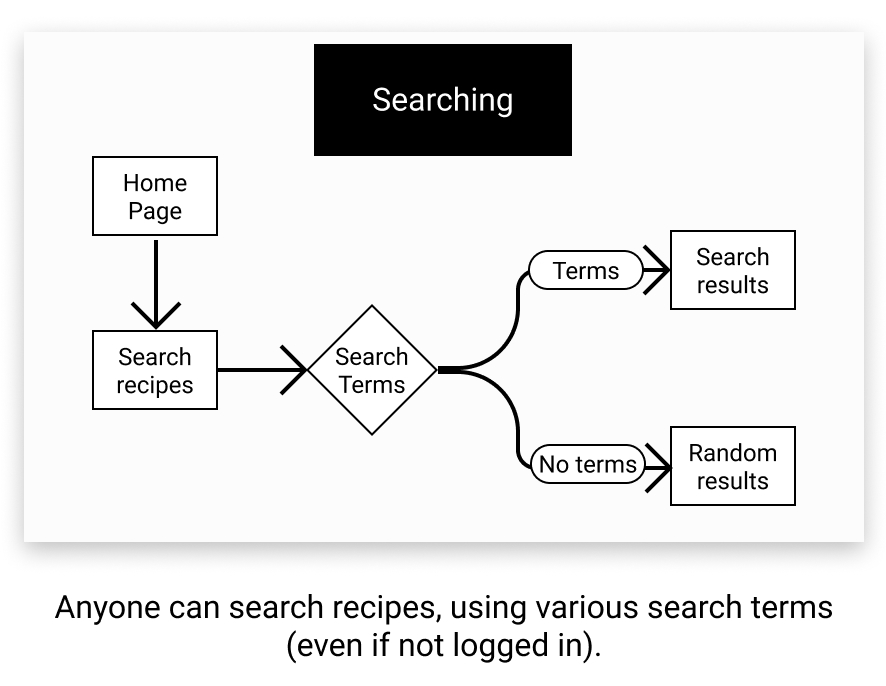
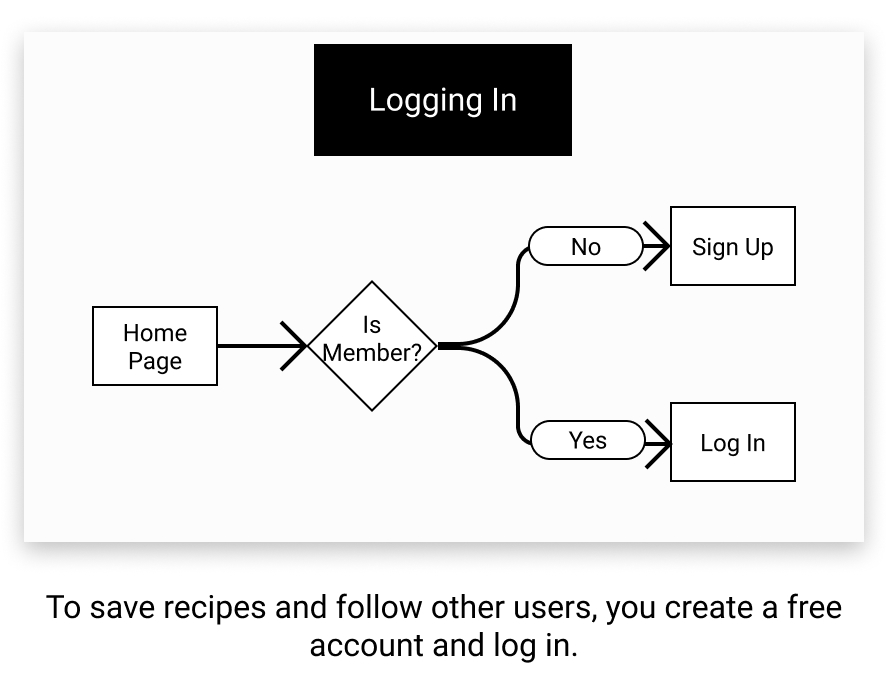
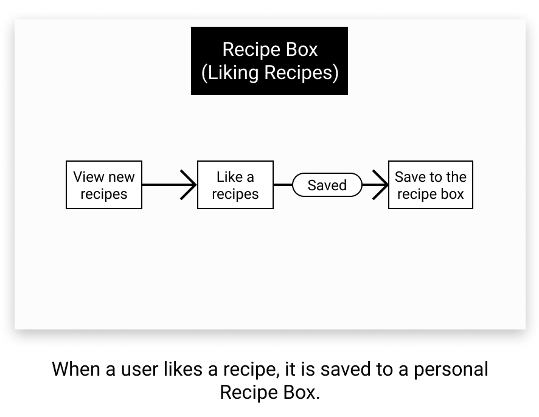
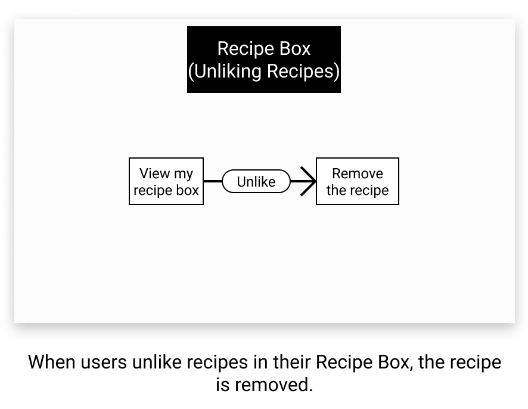

# Meal Planner App User Flows

# User Flow 1: Searching for Recipies (any user)
Users will visit a search page, where they will have the option to search for recipes:
 - by ingredients (e.g., "I have eggs, chicken, and celery. What could I make?")
 - by cuisine (e.g., "I'd like to try a new Italian recipe.")
 - by diet type (e.g., "I need to find a vegetarian recipe to cook for my guests.")
 - by intolerances (e.g., "I need to find a gluten-free recipe")
 - Random: ("Surpise me!")

---

# User Flow 2: Authentication
Users can view recipes without signing up, but to save and like recipes and follow other users, they will need to sign up.

When a user enters the site, users will be prompted to log in, or sign up if they do not have an account.

---

# User Flow 3: Liking Recipes
### (Requires Authentication)

As users view recipes, they can 'like' or 'unlike' a recipe. 
  - Liked recipes are saved to the users personal **Recipe Box**.
  - Users can 'unlike' recipes in their Recipe Box. Unliking a recipe removes it    from the user's Recipe Box.

---
# User Flow 4: Unliking Recipes
### (Requires Authentication)

As users view recipes in their personal Recipe Box, they can 'unlike' a recipe. 
  - Unliking a recipe removes the recipe from their Recipe Box.

---
# User Flow 5: Following Users
### (Requires Authentication)

Users can view other users who have liked the same recipe, and "follow" them, which means they can view their Recipe Boxes.

